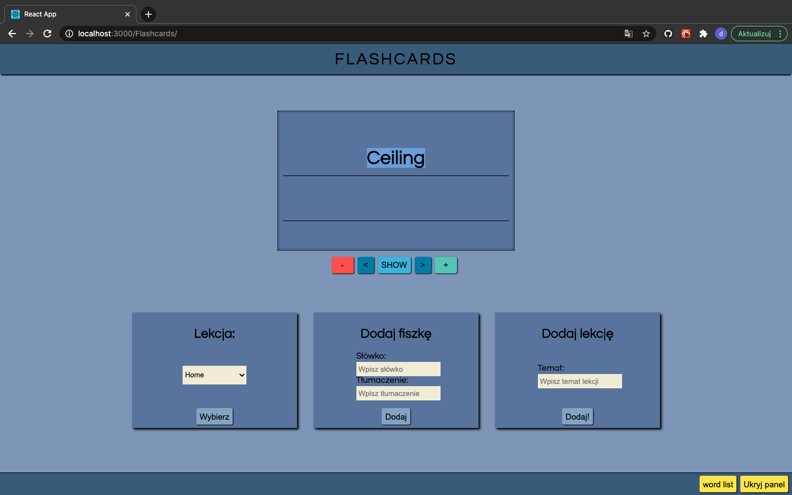

# Flashcards

> This is an app to learn new things by making cards and adding main word and description.

## Table of contents

- [Screenshots](#screenshots)
- [Demo](#demo)
- [Technologies](#technologies)
- [Setup](#setup)
- [Features](#features)
- [Status](#status)
- [Contact](#contact)

## Screenshots

## Demo

Live demo is available here: https://dawid131.github.io/Flashcards/

## Technologies

- React js - version 16.13.1
- Node js - version 12.18.0
- Mongo DB - version 3.0
- Mongoose - version 5.10.3
- Styled Components - version 5.2.0

## Setup

Clone this repo to your desktop and run `cd Api`, `npm install` to install all the dependencies
and `npm start` to start server.

Next in order to start client app run `cd ..`, `cd Client`, `npm install` to install all the dependencies
and `npm start` to start client app.

## Features

- Word list where we can find list of words which are in specific lesson.
- User authorization will be added in the future.

## Status

Project is: _in progress_

## Contact

Created by Dawid Kutwin.
e-mail: dawid.kutwin200@gmail.com
